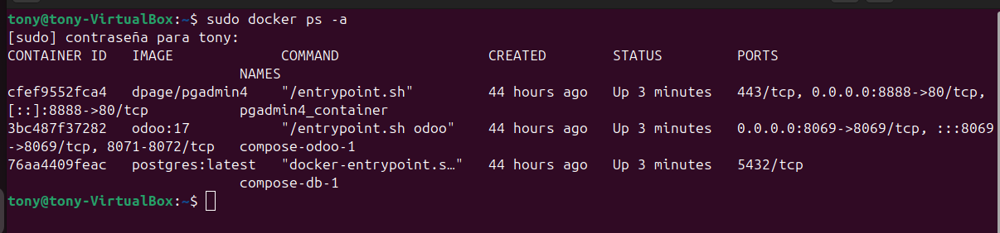
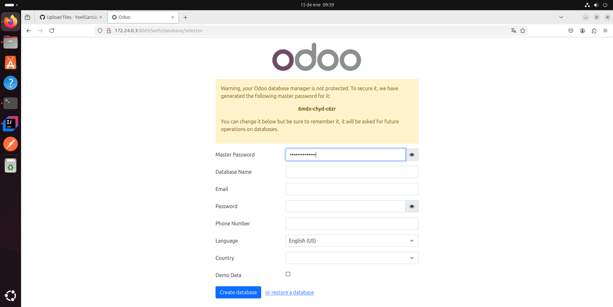
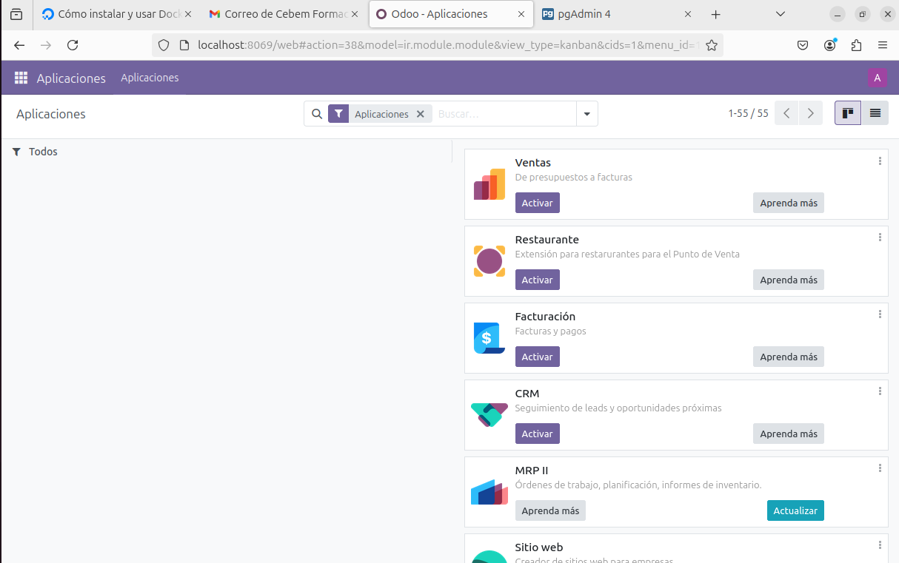
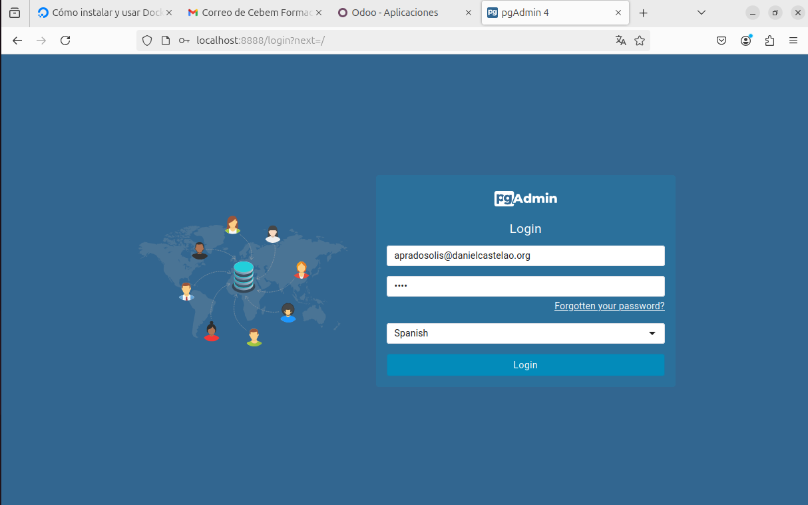
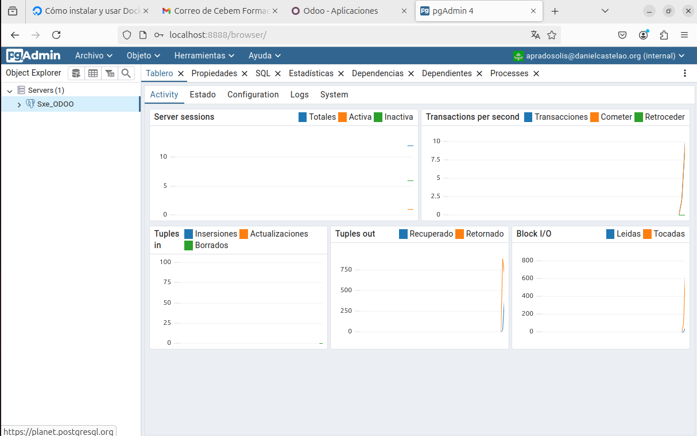
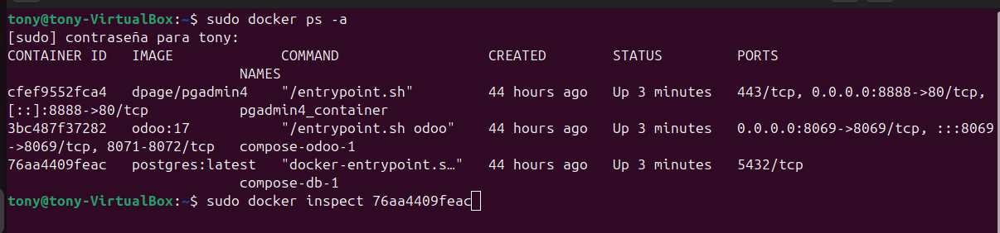
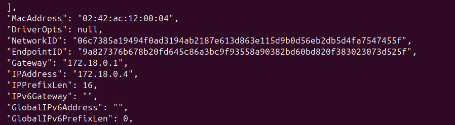
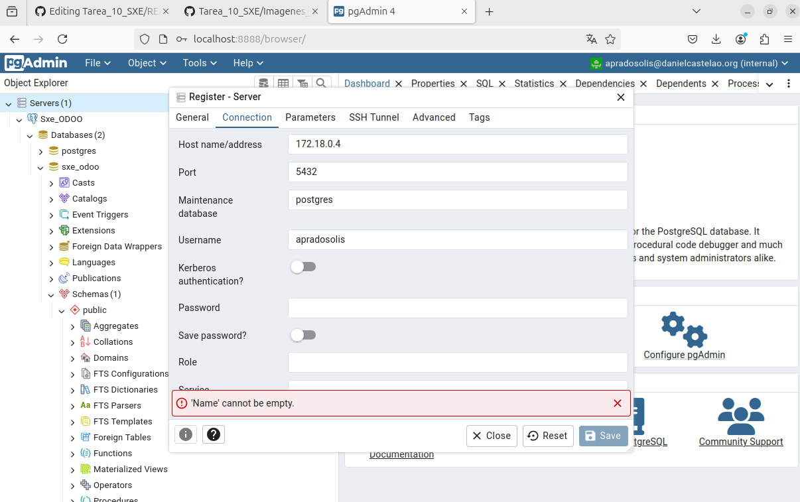
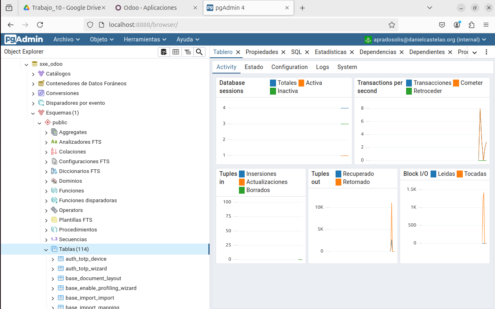

# Tarea_10_SXE

Para iniciar este proyecto tenemos que crear un docker compose con el siguiente contenido:
```bash
services:
  odoo:
    image: odoo:17  # Utilizamos la imagen de Odoo versión 17.
    restart: always  # El contenedor se reiniciará automáticamente si se detiene o si el sistema se reinicia.
    ports:
      - "8069:8069"  # Mapeamos el puerto 8069 del contenedor al 8069 del host, usado para la interfaz web de Odoo.
    depends_on:
      - db  # Este servicio depende del servicio 'db'
    environment:
      - USER=odoo  # Definimos el usuario de Odoo (usado para la conexión a la base de datos).
      - PASSWORD=odoo  # Definimos la contraseña de Odoo.
    volumes:
      - ./config:/etc/odoo  # Mapeamos el directorio local './config' al contenedor, para personalizar la configuración de Odoo.
      - ./extra-addons:/mnt/extra-addons  # Mapeamos el directorio local './extra-addons' al contenedor, para añadir módulos extra de Odoo.

  db:
    image: postgres:latest  # Utilizamos la última versión de PostgreSQL.
    restart: always 
    environment:
      - POSTGRES_USER=odoo  # Configuramos el usuario de PostgreSQL, debe coincidir con el usuario configurado en Odoo.
      - POSTGRES_PASSWORD=odoo  # Configuramos la contraseña de PostgreSQL, debe coincidir con la contraseña configurada en Odoo.
      - POSTGRES_DB=postgres  # Configuramos la base de datos por defecto que se usará en PostgreSQL.
    volumes:  
      - local_pgdata:/var/lib/postgresql/data  # Usamos un volumen persistente 'local_pgdata' para almacenar los datos de PostgreSQL de forma segura.

  pgadmin:
    image: dpage/pgadmin4  # Utilizamos la imagen oficial de pgAdmin 4, que es una herramienta para gestionar PostgreSQL desde una interfaz web.
    container_name: pgadmin4_container  # Le damos un nombre específico al contenedor
    restart: always 
    depends_on:
      - db 
    ports:
      - "8888:80"  # Mapeamos el puerto 80 del contenedor al puerto 8888 del host
    environment:
      PGADMIN_DEFAULT_EMAIL: apradosolis@danielcastelao.org  # Definimos el email predeterminado para acceder a pgAdmin.
      PGADMIN_DEFAULT_PASSWORD: 1234  # Definimos la contraseña predeterminada para acceder a pgAdmin.
    volumes:
      - pgadmin_data:/var/lib/pgadmin  # Usamos un volumen persistente 'pgadmin_data' para almacenar la configuración y los datos de pgAdmin.

volumes:
  local_pgdata:  # Volumen para almacenar los datos persistentes de PostgreSQL.
  pgadmin_data:  # Volumen para almacenar los datos persistentes de pgAdmin.
```
Con todo esto ahora tenemos que subir nuestro Docker Compose. Para esto realizaremos este comando:

```bash
sudo docker compose up -d
```

Para saber si todo este correcto podemos realizar el siguiente comando:

```bash
sudo docker ps -a
```
Este comando sirve para ver si los servicios estan ejecutandose, como en esta imagen:



Ahora iremos al navegador para entrar en Odoo:

Esta imagen está proporcionada por mi compañero Yoel García, ya que no hice en su debido tiempo esa captura de pantalla.


Luego de rellenar todos los campos de Odoo, podremos iniciar Sesión en Odoo, si tenemos todo correcto al rellenar los campos requeridos, entraremos en Odoo:


Este apartado ya quedaría finalizado, pero ahora falta entrar en PgAdmin.

Ahora tenemos que iniciar sesión en pgAdmin:



Al entrar en pgAdmin tendremos lo siguiente:


Ahora para relacionar nuestra base de datos con las tablas de odoo tenemos que realizar lo siguiente:



Esto lo hacemos para ver la información de este contenedor en concreto:



Con esta informacion tenemos que copiar la ip que en este caso es: 
```bash
172.18.0.4
```
Ahora tenemos que dar click derecho en la carpeta Servers(1), le damos a Register y luego a Server.

Tendremos que rellenar los apartados, hay un apartado el cual tendremos que pegar la ip del contenedor de postgres (172.18.0.4).


Finalmente podremos ver todas las tablas que tiene Odoo.


Ya lo tendriamos todo funcionando.

# Preguntas
